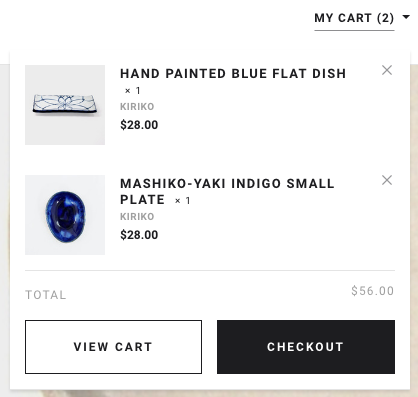
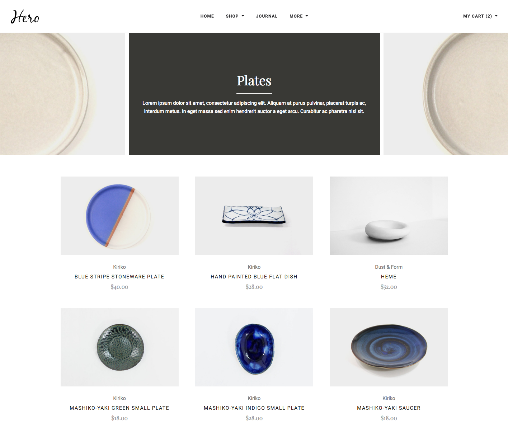
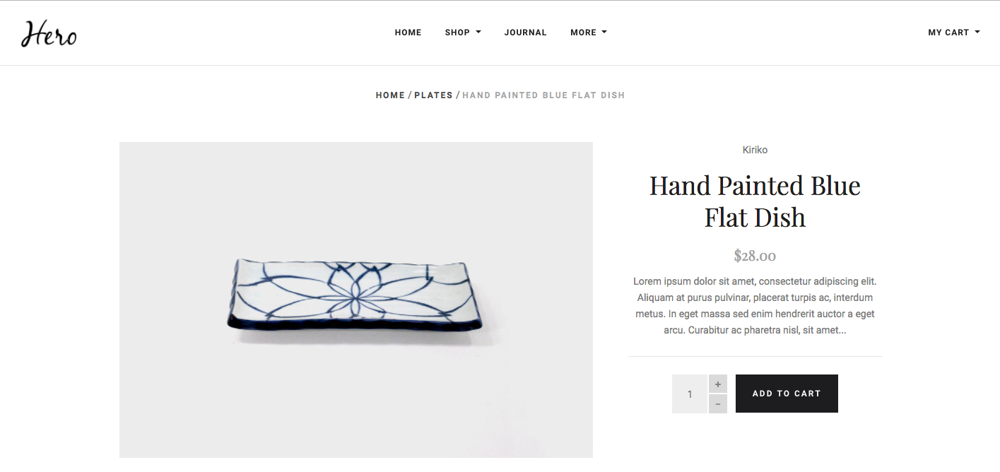
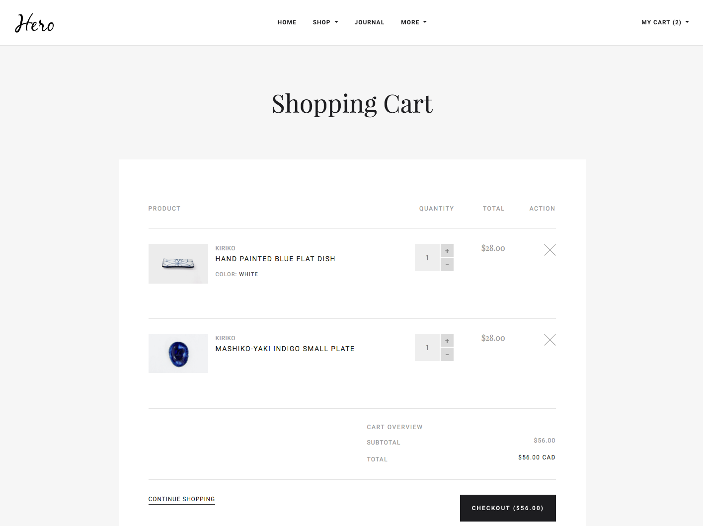

# Storefront
En cliquant sur le lien "shop' dans le menu vous êtes redirigé la page de détails du produit (la manipulation n'est possible que dans la version ordinateur).

Afin de pouvoir explorer la page du panier il faut cliquer sur le bouton "my cart"; ce click fait
apparaitre la cart-popup. En cliquant sur le bouton view cart ou checkout vous êtes rediriger vers celle-ci.

### Écrans
#### Page de liste de catégories:

#### Page de détails du produit:

#### Page du panier:

